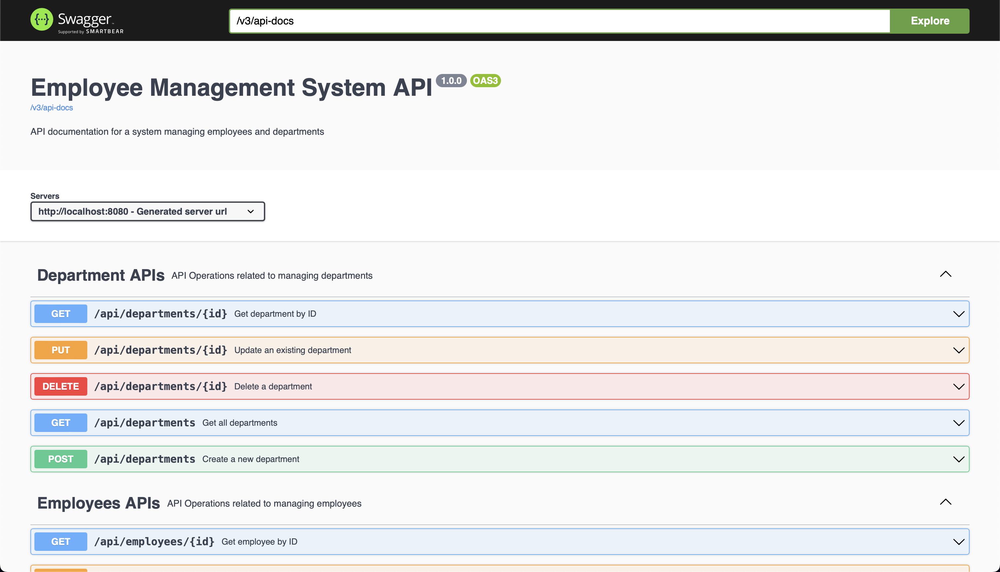

<<<<<<< HEAD
# Employee Management System - Backend

## Overview

The backend of the Employee Management System is built using Spring Boot, a powerful Java framework designed to simplify the development of production-ready applications. This backend provides a RESTful API for managing employee and department data, connecting to both MySQL and MongoDB databases.

## Features

- **RESTful API**: Provides endpoints for CRUD operations on employees and departments.
- **Data Initialization**: Includes sample data for departments and employees.
- **Integration**: Connects to both MySQL and MongoDB databases.
- **Exception Handling**: Custom error handling for not found resources.

## Technologies

- **Spring Boot**: Framework for building production-ready applications with Java.
- **MySQL**: Relational database for structured data storage.
- **MongoDB**: NoSQL database for non-relational data storage.

## File Structure

=======
# Employee Management System - Frontend

## Overview

The Employee Management System frontend is a **React-based** application that provides a user interface for managing employee and department data. The app includes features for viewing, adding, editing, and deleting employees and departments. It also includes visualizations for employee metrics such as growth over time and distribution by age range.

## File Structure

Here's a high-level overview of the file structure:

>>>>>>> 240cc20 (Initial commit - React Frontend)
```
employee-management-app
│
├── docker-compose.yaml
│
├── backend
<<<<<<< HEAD
│   ├── src
│   │   ├── main
│   │   │   ├── java
│   │   │   │   └── com
│   │   │   │       └── example
│   │   │   │           └── employeemanagement
│   │   │   │               ├── EmployeeManagementApplication.java
│   │   │   │               ├── config
│   │   │   │               │   └── CorsConfig.java
│   │   │   │               │   └── DataInitializer.java
│   │   │   │               ├── controller
│   │   │   │               │   ├── DepartmentController.java
│   │   │   │               │   └── EmployeeController.java
│   │   │   │               ├── model
│   │   │   │               │   ├── Department.java
│   │   │   │               │   └── Employee.java
│   │   │   │               ├── repository
│   │   │   │               │   ├── DepartmentRepository.java
│   │   │   │               │   └── EmployeeRepository.java
│   │   │   │               ├── service
│   │   │   │               │   └── DataInitializer.java
│   │   │   │               └── exception
│   │   │   │                   └── ResourceNotFoundException.java
│   │   │   └── resources
│   │   │       ├── application.properties
│   │   │       └── data.sql
│   │   └── test
│   │       └── java
│   │           └── com
│   │               └── example
│   │                   └── employeemanagement
│   │                       └── EmployeeManagementApplicationTests.java
│   ├── .gitignore
│   └── pom.xml
│   └── compose.yaml
│
└── frontend
    └── (frontend code)
```

## Setup Instructions

#### Important: Java 11 is required to run this project.
=======
│   └── (Backend code)
│
└── frontend
    ├── build
    ├── public
    │   ├── index.html
    │   └── favicon.ico
    │   └── manifest.json
    │   └── robots.txt
    │   └── icon-192x192.webp
    │   └── icon-512x512.webp
    ├── src
    │   ├── components
    │   │   ├── Dashboard.js
    │   │   ├── EmployeeList.js
    │   │   ├── EmployeeForm.js
    │   │   ├── DepartmentList.js
    │   │   ├── DepartmentForm.js
    │   │   └── Navbar.js
    │   ├── services
    │   │   ├── employeeService.js
    │   │   └── departmentService.js
    │   ├── App.js
    │   ├── index.js
    │   ├── index.css
    │   ├── reportWebVitals.js
    │   └── App.css
    │   └── theme.js
    ├── Dockerfile
    ├── postcss.config.js
    ├── tailwind.config.js
    └── package.json
```

## Dependencies

- **React**: Frontend library for building user interfaces.
- **React Router DOM**: For handling routing and navigation.
- **Material-UI**: For UI components and styling.
- **Chart.js**: For rendering charts and graphs.
- **Axios**: For making HTTP requests (if used in `employeeService` and `departmentService`).
- **Tailwind CSS**: For utility-first CSS framework (if used in `App.css`).

## Setup Instructions
>>>>>>> 240cc20 (Initial commit - React Frontend)

### 1. Clone the Repository

```bash
git clone https://github.com/hoangsonww/Employee-Management-Fullstack-App.git
<<<<<<< HEAD
cd Employee-Management/backend
=======
cd Employee-Management/frontend
>>>>>>> 240cc20 (Initial commit - React Frontend)
```

### 2. Install Dependencies

<<<<<<< HEAD
Ensure you have [Maven](https://maven.apache.org/) and [Java JDK](https://www.oracle.com/java/technologies/javase-jdk11-downloads.html) installed. Run the following command to install the required dependencies:

```bash
mvn install -DskipTests
```

### 3. Configure the Application

Update `src/main/resources/application.properties` with your database configuration:

```properties
# MySQL Configuration
spring.datasource.url=jdbc:mysql://localhost:3306/employee_management
spring.datasource.username=root
spring.datasource.password=password
spring.jpa.hibernate.ddl-auto=update

# MongoDB Configuration
spring.data.mongodb.uri=mongodb://localhost:27017/employee_management
```

Ensure the databases are set up as expected and the URLs, usernames, and passwords match your local or remote database setup.

### 4. Start the Backend Server

Run the following command to start the Spring Boot application:

```bash
mvn spring-boot:run
```

The backend server will be available at [http://localhost:8080](http://localhost:8080).

### 5. Access the API Endpoints

Here are some example API endpoints you can use to interact with the backend:

- **Get All Employees:**

  ```bash
  curl -X GET http://localhost:8080/api/employees
  ```

- **Get Employee by ID:**

  ```bash
  curl -X GET http://localhost:8080/api/employees/1
  ```

- **Create a New Employee:**

  ```bash
  curl -X POST http://localhost:8080/api/employees -H "Content-Type: application/json" -d '{"firstName": "John", "lastName": "Doe", "email": "john.doe@example.com", "departmentId": 1}'
  ```

- **Update an Employee:**

  ```bash
  curl -X PUT http://localhost:8080/api/employees/1 -H "Content-Type: application/json" -d '{"firstName": "John", "lastName": "Doe", "email": "john.doe@example.com", "departmentId": 1}'
  ```

- **Delete an Employee:**

  ```bash
  curl -X DELETE http://localhost:8080/api/employees/1
  ```

- **Get All Departments:**

  ```bash
  curl -X GET http://localhost:8080/api/departments
  ```

- **Get Department by ID:**

  ```bash
  curl -X GET http://localhost:8080/api/departments/1
  ```

### 6. Data Initialization

The `DataInitializer.java` class is used to preload sample data into the database. This is particularly useful for development and testing.

### 7. Running Tests

To run the unit and integration tests, use:

```bash
mvn test
```

## Detailed File Descriptions

### `EmployeeManagementApplication.java`

The main class that serves as the entry point for the Spring Boot application.

### `DepartmentController.java` and `EmployeeController.java`

REST controllers for handling HTTP requests related to departments and employees, respectively.

### `Department.java` and `Employee.java`

Entity classes representing the `departments` and `employees` tables in the MySQL database.

### `DepartmentRepository.java` and `EmployeeRepository.java`

Repository interfaces for performing CRUD operations on the `departments` and `employees` entities.

### `DataInitializer.java`

A service class that initializes the database with sample data upon application startup.

### `ResourceNotFoundException.java`

A custom exception class used for handling cases where requested resources are not found.

### `application.properties`

Configuration file for Spring Boot, including database connection settings.

### `data.sql`

SQL script for preloading sample data into the MySQL database.

## Swagger API Documentation

The backend API is documented using Swagger, which provides a user-friendly interface for exploring the available endpoints. To access the Swagger UI, navigate to [http://localhost:8080/swagger-ui.html](http://localhost:8080/swagger-ui.html) after starting the backend server.

If you have everything set up correctly, you should see the Swagger UI with a list of available endpoints and the ability to test them directly from the browser:

<p align="center" style="cursor: pointer">
  
</p>

## Troubleshooting

### Common Issues

- **`Could not autowire` Errors**: Ensure all Spring Boot components (controllers, services, repositories) are correctly annotated and located in the appropriate package structure.

- **`Exception opening socket` for MongoDB**: Verify that MongoDB is running and accessible at `localhost:27017`. Check MongoDB logs for connection issues.

- **`SQLSyntaxErrorException`**: Check the `data.sql` script and ensure the MySQL database schema matches the expected structure.

- **`Port Already in Use`**: If the default port `8080` is already in use, change the port in `application.properties` or terminate the conflicting process.

- **`CORS Error`**: If you encounter CORS issues, ensure that the `CorsConfig.java` class is correctly configured.

- **`Build failed`**: If the Maven build fails, check if you are using Java 11 and have the necessary dependencies installed. Also, check the error logs for more details.

## Contributing

If you'd like to contribute to the backend development, please fork the repository and submit a pull request with your changes. Ensure that you follow the project's coding standards and include relevant tests for new features.
=======
Ensure you have [Node.js](https://nodejs.org/) and [npm](https://www.npmjs.com/) installed. Run the following command to install the required dependencies:

```bash
npm install
```

### 3. Set Up Environment Variables

Create a `.env` file in the root of your project if it doesn't already exist. Add any required environment variables. For example:

```env
REACT_APP_API_URL=http://localhost:8080/api
```

Make sure to replace the `REACT_APP_API_URL` with your backend server URL.

### 4. Start the Development Server

Run the following command to start the development server:

```bash
npm start
```

This will start the React development server and open the application in your default web browser. The app will be available at [http://localhost:3000](http://localhost:3000).

### 5. Build for Production

To create a production build of your application, run:

```bash
npm run build
```

The build files will be generated in the `build` directory. You can deploy these files to your production server.

### 6. Running Tests

To run tests, use:

```bash
npm test
```

This will start the test runner and execute your test cases.

## Detailed Component Instructions

### `Dashboard.js`

Displays various metrics related to employees, such as total employee count, average age, employee growth over time, and distribution by age range. It uses `react-chartjs-2` to render bar charts.

### `EmployeeList.js`

Shows a list of employees with options to search, paginate, and delete entries. Includes a link to add a new employee and edit existing employees.

### `EmployeeForm.js`

Provides a form for adding or editing employee details. Fetches departments to populate the department dropdown. Uses `useParams` to determine if it's in edit mode or add mode.

### `DepartmentList.js`

Displays a list of departments with options to search, paginate, and delete entries. Includes a link to add a new department and edit existing departments.

### `DepartmentForm.js`

Provides a form for adding or editing department details.

### `Navbar.js`

The navigation bar component that includes links to various pages such as Dashboard, Employees, and Departments. Highlights the currently active page.

## Troubleshooting

- **Error: Cannot read properties of undefined (reading 'id')**: Ensure that the `employee` object in `EmployeeForm` is correctly initialized and that the `id` parameter is correctly passed. Check the `getEmployeeById` and `updateEmployee` functions for proper handling of data.

- **Chart Issues**: Ensure `Chart.js` and `react-chartjs-2` are correctly installed and configured. Verify that the chart data passed to components is in the correct format.

## Contributing

If you'd like to contribute to the project, please fork the repository and submit a pull request with your changes. Ensure that you follow the project's coding standards and include relevant tests for new features.
>>>>>>> 240cc20 (Initial commit - React Frontend)

## License

This project is licensed under the MIT License. See the [LICENSE](LICENSE) file for details.

<<<<<<< HEAD
## More Information

For more information about this project, please refer to the comprehensive [documentation](../README.md).

## Contact

For any questions or issues, please contact [hoangson091104@gmail.com](mailto:hoangson091104@gmail.com).

---
=======
## Contact

For any questions or issues, please contact [hoangson091104@gmail.com](mailto:hoangson091104@gmail.com).
>>>>>>> 240cc20 (Initial commit - React Frontend)
